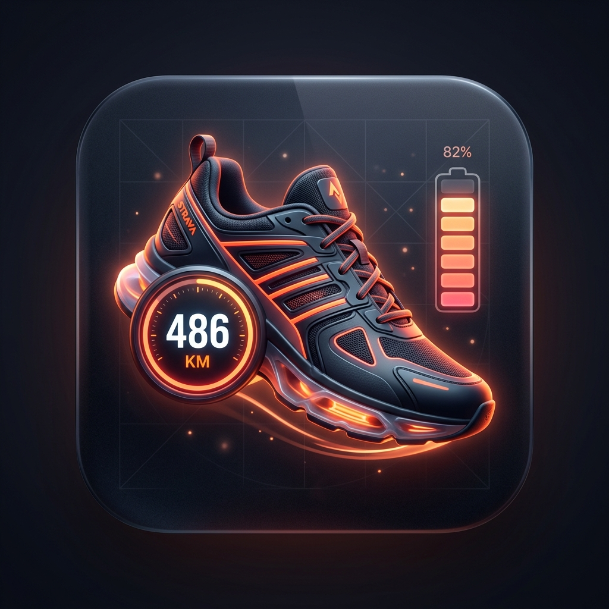

<p align="center">
  
</p>

# Strava Gear & Shoes Tracker for Home Assistant 👟🚲

[](https://hacs.xyz/)
[](https://www.home-assistant.io/)
[](https://www.gnu.org/licenses/gpl-3.0)
[](https://buymeacoffee.com/lediabloteur)

A dedicated Home Assistant custom integration for tracking all your **running shoes and bikes** from Strava. It dynamically discovers your equipment, tracks distance limits, calculates remaining mileage and wear percentages, and provides critical replacement alert binary sensors.

---

## ✨ Features

- 👟 **Individual Shoe Sensors**: Current distance (`km_parcourus`), Strava distance limit (`max_km`), remaining distance (`km_restants`), and wear % (`pourcentage_usure`).
- 🚲 **Individual Bike Sensors**: Gravel, road, and mountain bike mileage with wear metrics if a limit is defined on Strava.
- 🏷️ **Complete Strava Attributes**: Exposes all Strava equipment data directly on the entity (brand, model, nickname, description, bike weight, frame type, primary, retired, distance in meters, and raw Strava payload).
- 📱 **Home Assistant Device Registry**: Automatically groups sensors and wear alerts into individual equipment Devices (`Chaussure`, `Vélo`).
- 🎯 **Automatic Strava Limit Sync**: Directly synchronizes the distance notification limit set on Strava for each piece of equipment.
- ⚠️ **Wear Alert Binary Sensors**: Turns `ON` when gear reaches 95% or 100% wear to trigger automated replacement notifications.
- ⚡ **Dynamic Discovery & OAuth Auto-refresh**: Discovers all active gear from your Strava profile (`/athlete`) and recent activities without any hardcoded IDs, and automatically refreshes OAuth access tokens in the background.

---

## 🔑 Strava API Setup (Required)

> [!IMPORTANT]
> **This integration does NOT include or bundle any personal API keys.**
> Each user must create their own free Strava API application to access their own private equipment and activities securely. Follow the 3 simple steps below:

### Step 1: Create your Strava API Application

1. Log in to [Strava](https://www.strava.com).
2. Go to the **[Strava API Settings](https://www.strava.com/settings/api)** page.
3. Fill out the application form:
   - **Application Name**: `Home Assistant Gear` (or your choice)
   - **Category**: `Personal`
   - **Club**: Leave blank
   - **Website**: `https://my.home-assistant.io` (or `http://localhost`)
   - **Authorization Callback Domain**: `localhost`
4. Click **Create** / **Save**.
5. Once created, note your:
   - **Client ID** (e.g. `174123`)
   - **Client Secret** (e.g. `7a9b8c0d1e2f3a4b5c6d...`)

---

### Step 2: Generate your initial Refresh Token with required scopes

> [!WARNING]
> The default *"Your Refresh Token"* displayed on the Strava API settings page only has the basic `read` scope. It will **NOT** allow Home Assistant to access your shoes, bikes, or activities!
> You must authorize access with the `read,profile:read_all,activity:read_all` scopes.

#### 1. Authorize in your browser
Replace `YOUR_CLIENT_ID` with your actual Client ID in the following URL, then open it in your web browser:

```text
https://www.strava.com/oauth/authorize?client_id=YOUR_CLIENT_ID&response_type=code&redirect_uri=http://localhost&approval_prompt=force&scope=read,profile:read_all,activity:read_all
```

Click **Authorize** on the Strava page.

#### 2. Copy the authorization code
Your browser will redirect to a page that looks like:
```text
http://localhost/?state=&code=4e8b3f1234abcd567890ef...&scope=read,activity:read_all,profile:read_all
```
*(It is normal if your browser displays "This site can’t be reached" or "Unable to connect" because nothing is running on localhost).*

Copy the value between `code=` and `&scope=` in your browser's address bar. This is your temporary **Authorization Code**.

#### 3. Exchange the code for your Refresh Token
Run one of the following commands in your terminal (replace `YOUR_CLIENT_ID`, `YOUR_CLIENT_SECRET`, and `YOUR_AUTHORIZATION_CODE`):

**Using cURL (Linux / macOS / Git Bash):**
```bash
curl -X POST https://www.strava.com/oauth/token \
  -F client_id=YOUR_CLIENT_ID \
  -F client_secret=YOUR_CLIENT_SECRET \
  -F code=YOUR_AUTHORIZATION_CODE \
  -F grant_type=authorization_code
```

**Using PowerShell (Windows):**
```powershell
Invoke-RestMethod -Uri "https://www.strava.com/oauth/token" -Method Post -Body @{
  client_id = "YOUR_CLIENT_ID"
  client_secret = "YOUR_CLIENT_SECRET"
  code = "YOUR_AUTHORIZATION_CODE"
  grant_type = "authorization_code"
}
```

In the JSON output, copy the value of `"refresh_token"`. This token will be used by Home Assistant to automatically fetch and refresh access tokens indefinitely.

---

## 🚀 Installation via HACS

1. In Home Assistant, open **HACS** > **Integrations**.
2. Click the top right three dots `...` > **Custom repositories**.
3. Add `https://github.com/lediabloteur/ha-strava-gear` with Category **Integration**.
4. Click **Download** and choose the latest version.
5. **Restart Home Assistant**.
6. In Home Assistant, go to **Settings** > **Devices & Services** > **Add Integration**.
7. Search for **Strava Gear** (or **Strava Gear & Shoes Tracker**).
8. Enter:
   - **Strava Client ID**
   - **Strava Client Secret**
   - **Strava Refresh Token**
9. Click **Submit**.

Home Assistant will immediately connect to your Strava profile, dynamically discover all your shoes and bikes, and create individual entities and devices.

---

## 📊 Sensor Attributes

Each shoe and bike entity exposes both English and French attribute names for compatibility with all dashboard templates and automations:

| Attribute | French Alias | Description |
|---|---|---|
| `brand` | `marque` | Equipment brand (e.g. `ASICS`, `Salomon`, `Nakamura`) |
| `model` | `modele` | Equipment model (e.g. `Nimbus 26`, `Allroad 250`) |
| `nickname` | `surnom` | Custom nickname set in Strava (e.g. `Gravel`, `Sortie longue`) |
| `distance_km` | `km_parcourus` | Current cumulative distance in kilometers |
| `max_km` | `km_total` / `limite_km` | Distance limit defined on Strava (`notification_distance`) |
| `remaining_km` | `km_restants` | Remaining kilometers before limit |
| `wear_pct` | `pourcentage_usure` | Current wear percentage (0% to 100%) |
| `weight` | `poids` | Bike weight in kg (if specified on Strava) |
| `frame_type` | `type_cadre` | Strava bike frame type index |
| `description` | - | Equipment description from Strava |
| `strava_data` | - | Full raw JSON dictionary returned by Strava API |

---

## ☕ Support the Project

If this integration helps you track your running shoes or bike components in Home Assistant, consider supporting the project!

<p align="left">
  <a href="https://buymeacoffee.com/lediabloteur" target="_blank">
    
  </a>
</p>

## 📄 License

This project is licensed under the **GNU General Public License v3.0 (GPLv3)** - see the [LICENSE](LICENSE) file for details.
